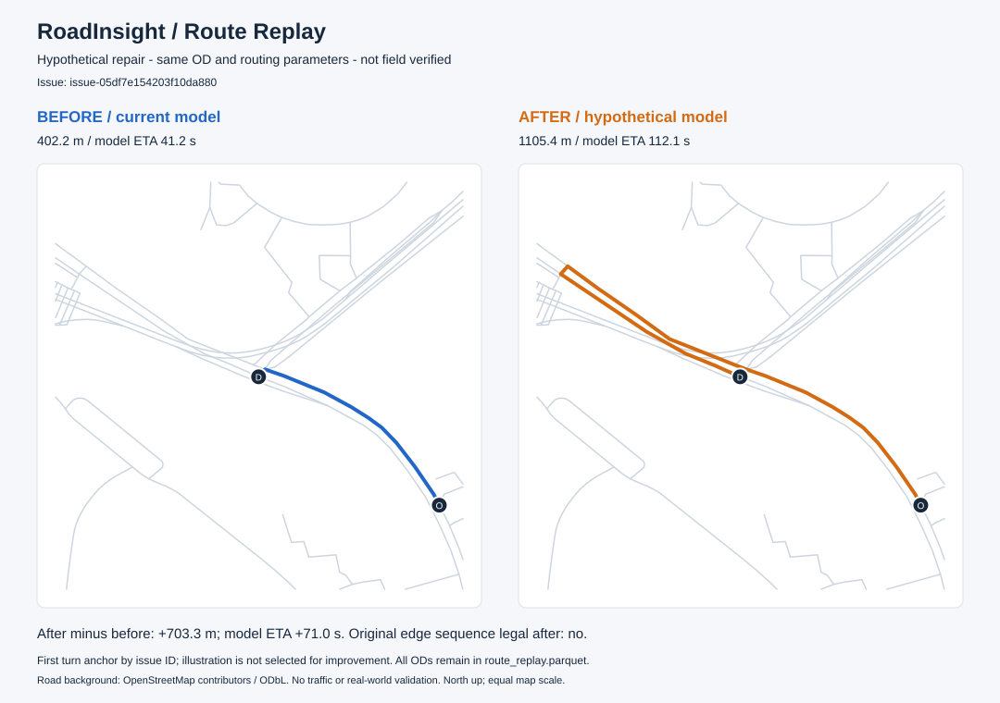

# RoadInsight V2 — STEP 7 Route Replay

本项目是根据公开岗位要求与公开业务场景设计的求职 Demo。这里的“修复”是**待核验假设在路网副本上的应用**，不是已确认的地图更新；ETA 是静态速度模型估计。

## 1. 运行

已有 STEP 5 inputs 和 STEP 6 analysis 时：

```bash
python scripts/07_replay.py \
  --inputs data/runtime/benchmark_seed42/inputs/manifest.json \
  --analysis data/runtime/analysis_seed42/manifest.json \
  --output data/runtime/replay_seed42
```

默认参数文件：`config/replay.json`。命令不访问网络，不读取 Golden 或注入答案。输出目录必须不存在；重跑请使用新目录。若需要从已提交原始数据重建，先按 `OSM_PIPELINE.md`、`BENCHMARK_DATA.md`、`ISSUE_ANALYSIS.md` 依次执行 STEP 4–6 脚本。PowerShell 中可将上述命令写为一行。

完整运行以最后写出的 `manifest.json` 为完成标记。没有该文件的目录视为未完成，不能作为演示结果。

## 2. 当前默认数据的实际结果

18 个 STEP 6 Issue 生成 18 个可审阅方案，其中 14 个可以在模型中执行，4 个缺路候选需要补充核验。每个可执行方案独立使用原始当前网络，再生成一个派生版本；方案不累计叠加。

| 修复假设 | 数量 | 操作 |
| --- | ---: | --- |
| 拓扑断点 | 5 | 将唯一相邻路段的断点端延伸到候选节点 |
| 单行方向异常 | 6 | 反转单行方向，几何存储方向保持不变 |
| 缺失转向限制 | 3 | 为具体的进入边／离开边添加禁转 |
| 缺路候选 | 4 | 待核验，不猜测道路端点、方向或通行权 |

14 个方案各取一组问题邻近起终点（OD）和一组反向对照，共 **28 组前后比较**：

| 结果 | 组数 |
| --- | ---: |
| 前后均可达，距离缩短 | 10 |
| 前后均可达，距离增加 | 8 |
| 前后均可达，距离相同 | 5 |
| 恢复可达 | 4 |
| 失去可达 | 1 |

23 组路径发生变化；9 条原路线的边序列在假设修复后不再合法；5 组对照路线前后均未经过修复目标，也保留在结果中。上述数字来自程序实际运行，是这组诊断样例的结果，**不是真实路网准确率、总体优化率或业务收益**。运行环境与结果指纹见 `data/replay/default_summary.json`。

## 3. 可直接展示的案例



图示选取按 Issue ID 排序的第一个禁转方案的正向 OD，选择时不筛选“是否改善”。对应 Issue 为 `issue-05df7e154203f10da880`：

| 指标 | 当前模型 | 假设修复后 |
| --- | ---: | ---: |
| 距离 | 402.164 m | 1105.416 m |
| 模型 ETA | 41.195 s | 112.148 s |
| 各自版本中路线合法 | 是 | 是 |
| 原边序列在修复后合法 | — | 否 |

距离增加 703.252 m，模型 ETA 增加 70.953 s。原因是添加了候选禁转，路线需要绕行。**这证明路由能响应限制变化，不证明该禁转在现实中成立。** 需人工核验路口规则后，才能决定是否采纳修复。

SVG 不依赖在线底图，双图采用同一范围和比例尺，O 为起点、D 为终点。背景道路来源为 OpenStreetMap contributors / ODbL。新数据重跑时会重新生成图示；完整前后路径见 GeoJSON 和 Parquet。

## 4. 路由与 ETA 口径

`TurnAwareRouter` 使用以**进入有向边**为状态的 Dijkstra 搜索，保留平行道路的边 ID。仅按节点标记“访问过”会漏掉从另一条边进入路口、因此允许转出的路线；独立小图测试覆盖这个反例。

- `forward` / `reverse` / `both` 决定可行驶有向边；反向行驶时同时反转路径几何。
- 支持现有静态 via-node 的 `no_left_turn`、`no_right_turn`、`no_straight_on`、`no_u_turn`、`only_left_turn`、`only_right_turn`、`only_straight_on`。未知语义拒绝运行。
- 默认禁止同一路段立即折返，可显式启用；显式禁转始终优先。多个 only 规则取交集，矛盾约束可能导致不可达。
- 不支持时间条件、车型条件、via-way 限制和实时道路封闭。输入使用已有静态 motorcar 筛选结果。
- `network/graph_builder.py` 的普通图仍只附带限制信息；必须使用新路由器执行受限搜索，不能将普通 NetworkX 最短路当作本步骤结果。

距离为路径上 `length_m` 之和；默认优化距离，也可设置 `objective: "eta"`。二者都输出距离和 ETA，不承诺两种指标同时最优。

```text
边速度 = min(道路等级模型速度, 有效 maxspeed)；没有 maxspeed 时使用模型速度
边行驶秒数 = length_m / speed_kmh × 3.6
路径 ETA = Σ 边行驶秒数 + Σ 转向附加秒数
```

等级速度、缺省 25 km/h、转向 5 秒、掉头 10 秒均来自配置，是演示假设。转角使用投影到 EPSG:32651 后的首尾局部航向：绝对角度 ≥30° 计转向、≥150° 计掉头。无实时拥堵、信号灯周期或实测速度校准。

## 5. 修复方案与保护条件

`repair_plan.json` 包含 Issue ID、来源分析运行、基准版本及内容指纹、操作、预期原值、拟修改值、OD、假设理由、状态和派生版本。应用前重新从当前快照生成方案并逐项比较；内容或参数变化后旧方案失效。直接手改方案不作为任意路网写入接口。

- 断点：只处理一个相邻路段、正距离且不超过 15 m 的候选节点对；拒绝自环、不可路由对象及断点上的转向限制。按端点方向追加几何、重算米制长度；保留旧节点为孤立节点，重算度数。临近不等于真实连通，立交和通行权仍须核验。
- 单行：须匹配当前方向；若关联现有转向限制则转人工协调审核，避免改变方向后产生悬空引用。
- 缺失禁转：确认当前模型确实允许该具体转向，再添加指向明确有向边的限制；左／右／直行名称来自几何角度。
- 观测到禁止转向：可假设移除阻止该转向的精确 `no_*` 规则；`only_*` 的放宽会影响其他转向，保留人工审核。
- 缺路：轨迹走廊不足以确定端点、单行和通行条件，本步不自动建路。

`ready` 仅表示模型方案可执行；所有结果均为 `is_hypothetical=true`、`verification_status=not_field_verified`。原网络、轨迹、反馈、Issue 状态、Severity、Confidence、STEP 6 潜在业务影响均不被修改。

## 6. 对比规则与业务解释

单行方案优先取假设新方向的路段端点；断点方案取相邻路段远端到候选接入节点；转向方案取进入边起点到离开边终点。随后取反向对照。选择发生在路由前，不尝试不同 OD 直到“结果更好”；起终点重合的环形转向转人工补充 OD。

- 前后使用相同起终点、目标函数、速度与转向参数。
- `distance_delta_m` / `eta_delta_s` 均为 **after − before**，正值允许存在。
- 仅前后都可达时计算差值；无路径不是 0 米、0 秒，不计算虚假的节省比例。
- 路由返回 `found`、`no_path`、`invalid_endpoint`、`ineligible_endpoint`；独立路由 API 对合法同点请求返回 `same_node` / 0。本批 OD 保证不同点。
- 检查两条路线各自在对应版本中合法；额外检验原边序列是否在新版本仍合法。后者描述边序列，并不等于原几何未变化。
- 记录目标是否真正被路线经过；无变化和未经过的对照都保留。

这些结果支持解释 Navigation 的规则合法性、Route Planning 的模型可达性与距离、静态模型 ETA 的变化。没有订单需求、车辆位置、任务时窗或真实 POI 样本，**不能由 28 个问题邻近 OD 推导真实 Dispatch 或 POI 业务收益**。裁剪边界、临时禁行和未知道路可能造成模型中的 NoPath。

## 7. 输出与架构

```text
scripts/07_replay.py                 命令入口
src/network/routing.py              受转向限制的路由
src/replay/patches.py                纯方案生成与副本修复
src/replay/route_replay.py           OD 与前后指标对比
src/replay_pipeline.py              版本核验、组合和导出
src/replay_visualization.py         离线 SVG 图示
src/data_sources/replay_results.py  独立 DuckDB 写入
sql/v2_replay_schema.sql            类型、主键、关联约束
```

每个输出目录包含：

- `source_road_issue.parquet`：原 Issue 防御性副本，关联证据摘要及来源运行；
- `repair_plan.json` / `repair_audit.json`：方案与修改前后审计；
- `route_replay.parquet` / `replay.duckdb`：带 Issue、方案、运行、前后版本的计算结果；
- `routes.geojson` / `route_example.svg`：全部可达路径和一组离线图示；空 Issue 批次不生成 SVG；
- `cases/<patch_id>/network/`：每个独立假设的三张网络表及 FileDataSource 可读取的 manifest；仅供路由，不伪造对应版本的观测数据；
- `manifest.json`：五类输入指纹、来源分析指纹、规则、代码、依赖环境、结果内容指纹和所有导出文件的字节校验值。

本步骤沿用 STEP 2 的 `route_replay` 逻辑实体。实现中的 `before_status` / `after_status` 对应原规划的 `before_route_status` / `after_route_status`；`before_route_json` / `after_route_json` 扩展了原 `*_path_json`，包括边序列、逐边速度、时间、转向延迟和几何。新增可达性、合法性、假设状态等审计字段。

## 8. 验证与限制

单元测试覆盖平行边、进入边状态、no/only 转向、反向单行、速度上限、目标函数、不可达空值、修改前置条件与原数据不变。完整测试用临时生成的 seed=42 数据，复制独立 inputs 后禁止读取 Golden/答案，连续重放两次，并从输出快照重新计算每条路线核对结果。另检查零 Issue、文件损坏、版本不一致和输出覆盖拒绝。

运行 ID、时间和耗时会变化；语义比较排除 replay run_id 与来源分析 run_id。固定源码／配置使用指纹验证；跨平台投影和序列化可能有细小差异，逐字节复现只在相同环境和输入下解释。图示和摘要是提交的演示产物，完整数据库和网络副本留在忽略跟踪的 `data/runtime/`。

本步骤保留旧应用和六个旧模块，不引入新依赖。STEP 8 三个核心页面仍待单独确认。
